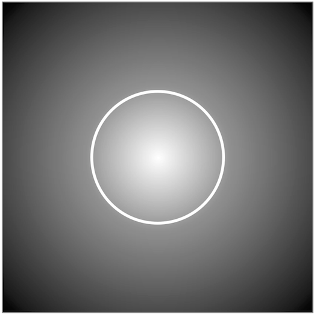

# Discrete Half Flux Diameter

A colleague interested in astrophotography asked me for an algorithm to compute the _half-flux diameter_ of an image. Originally written on February 3, 2013.

## Creator

That would be me, _Wagner Truppel_. If you need or want to contact me, send a message to `wagner` at `restlessbrain` dot com.

## License

I'm sharing this work under the [Creative Commons Attribution-ShareAlike 4.0 International (CC BY-SA 4.0)](http://creativecommons.org/licenses/by-sa/4.0/) license. See the LICENSE file for more information.
